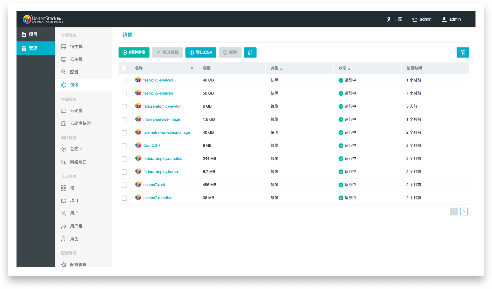

# Halo
Halo is a NodeJS based OpenStack Dashboard. It provides a web dashboad to do interaction between OpenStack services including Nova, Keystone, Swift and so on.

[](https://travis-ci.org/unitedstack/halo)



## Related Modules

* [Openstack project client](https://github.com/unitedstack/spectre)
* [OpenStack admin client](https://github.com/unitedstack/medusa)
* [login client](https://github.com/unitedstack/luna)
* [register client](https://github.com/unitedstack/lion)
* [register and login server](https://github.com/unitedstack/brewmaster)
* [configuration server](https://github.com/unitedstack/tusk)
* [OpenStack API](https://github.com/unitedstack/slardar)
* [OpenStack Driver](https://github.com/unitedstack/huskar)
* [mysql driver](https://github.com/unitedstack/meepo)

## Usage

Get your code ready:
```
git clone git@github.com:unitedstack/halo.git --recursive
```

Init project
```
./init.sh
```

Start Service
```
npm start
```

Then visit `localhost:5678` to preview the effect.

## Scripts

For more scripts, Please visit [http://halo.ustack.com/started/scripts.html](http://halo.ustack.com/started/scripts.html).

## Issues

Please make sure to read the [Issue Reporting Checklist](./.github/CONTRIBUTING.md#Issues) before opening an issue.

## Contribution

Halo welcome every one who wants to contribute the code, please read over [CONTRIBUTING](./.github/CONTRIBUTING.md) first.

## Code Convention

Before development, please read over Halo [Code Convention](./.github/CODE_CONVENTION.md).

## Change Log

Please visit [Change Log](./CHANGELOG.md).

## Stay In Touch

For the latest releases and announcements, follow us:

* Weibo: [@UnitedStack_Halo](http://weibo.com/u/6344552711)
* Twitter: [@ustack_halo](https://twitter.com/ustack_halo)
